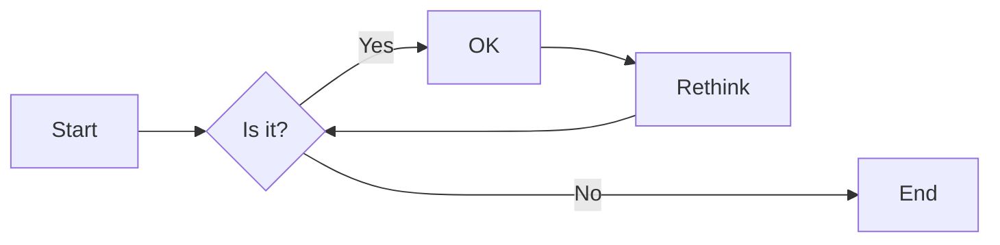
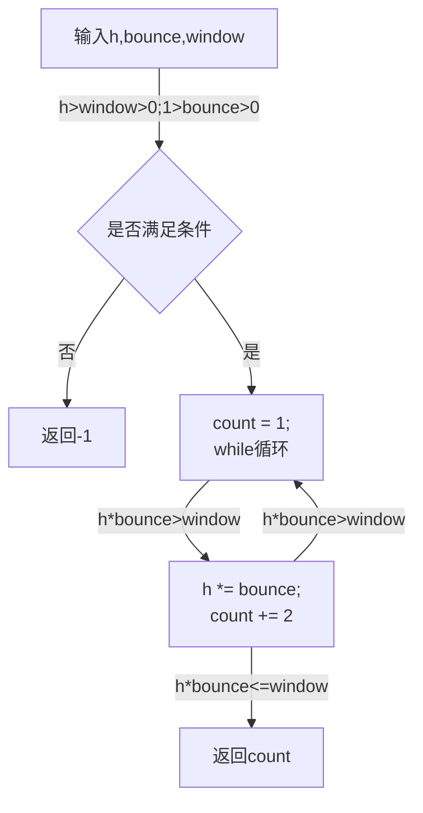

# 实验二 Python变量、简单数据类型

班级： 21计科3班

学号： B20210302301

姓名： 杨韬

Github地址：<https://github.com/bairimenglin/yangtao/tree/main/experiment>

CodeWars地址：<https://www.codewars.com/users/bairimenglin>

---

## 实验目的

1. 使用VSCode编写和运行Python程序
2. 学习Python变量和简单数据类型

## 实验环境

1. Git
2. Python 3.10
3. VSCode
4. VSCode插件

## 实验内容和步骤

### 第一部分

实验环境的安装

1. 安装Python，从Python官网下载Python 3.10安装包，下载后直接点击可以安装：[Python官网地址](https://www.python.org/downloads/)
2. 为了在VSCode集成环境下编写和运行Python程序，安装下列VScode插件
   - Python
   - Python Environment Manager
   - Python Indent
   - Python Extended
   - Python Docstring Generator
   - Jupyter
   - indent-rainbow
   - Jinja

---

### 第二部分

Python变量、简单数据类型和列表简介

完成教材《Python编程从入门到实践》下列章节的练习：

- 第2章 变量和简单数据类型

---

### 第三部分

在[Codewars网站](https://www.codewars.com)注册账号，完成下列Kata挑战：

---

#### 第1题：求离整数n最近的平方数（Find Nearest square number）

难度：8kyu

你的任务是找到一个正整数n的最近的平方数
例如，如果n=111，那么nearest_sq(n)（nearestSq(n)）等于121，因为111比100（10的平方）更接近121（11的平方）。
如果n已经是完全平方（例如n=144，n=81，等等），你需要直接返回n。
代码提交地址
<https://www.codewars.com/kata/5a805d8cafa10f8b930005ba>

---

#### 第2题：弹跳的球（Bouncing Balls）

难度：6kyu

一个孩子在一栋高楼的第N层玩球。这层楼离地面的高度h是已知的。他把球从窗口扔出去。球弹了起来,  例如:弹到其高度的三分之二（弹力为0.66）。他的母亲从离地面w米的窗户向外看,母亲会看到球在她的窗前经过多少次（包括球下落和反弹的时候）？

一个有效的实验必须满足三个条件：

- 参数 "h"（米）必须大于0
- 参数 "bounce "必须大于0且小于1
- 参数 “window "必须小于h。

如果以上三个条件都满足，返回一个正整数，否则返回-1。
**注意:只有当反弹球的高度严格大于窗口参数时，才能看到球。**
代码提交地址
<https://www.codewars.com/kata/5544c7a5cb454edb3c000047/train/python>

---

#### 第3题： 元音统计(Vowel Count)

难度： 7kyu

返回给定字符串中元音的数量（计数）。对于这个Kata，我们将考虑a、e、i、o、u作为元音（但不包括y）。输入的字符串将只由小写字母和/或空格组成。

代码提交地址：
<https://www.codewars.com/kata/54ff3102c1bad923760001f3>

---

#### 第4题：偶数或者奇数（Even or Odd）

难度：8kyu

创建一个函数接收一个整数作为参数，当整数为偶数时返回”Even”当整数位奇数时返回”Odd”。
代码提交地址：
<https://www.codewars.com/kata/53da3dbb4a5168369a0000fe>

### 第四部分

使用Mermaid绘制程序流程图

安装Mermaid的VSCode插件：

- Markdown Preview Mermaid Support
- Mermaid Markdown Syntax Highlighting

使用Markdown语法绘制你的程序绘制程序流程图（至少一个），Markdown代码如下：


显示效果如下：



查看Mermaid流程图语法-->[点击这里](https://mermaid.js.org/syntax/flowchart.html)

使用Markdown编辑器（例如VScode）编写本次实验的实验报告，包括[实验过程与结果](#实验过程与结果)、[实验考查](#实验考查)和[实验总结](#实验总结)，并将其导出为 **PDF格式** 来提交。

## 实验过程与结果

请将实验过程与结果放在这里，包括：

- [第二部分 Python变量、简单数据类型和列表简介](#第二部分)
- ### 练习2.1:
```python
message = "Hello Python world!"
print(message)
```

输出：Hello Python world!

- ### 练习2.2:
```python
message = "Hello Python world!"
print(message)
message = "Hello!"
print(message)
```

输出：
Hello Python world!
Hello!

- ### 练习2.3:
```python
name = "Hello Eric,would you like to learn some Python today?"
print(name)
```

输出:Hello Eric,would you like to learn some Python today?

- ### 练习2.4:
```python
name = "miKe"
print(name.lower())
print(name.upper())
print(name.title())
```

输出:
mike
MIKE
Mike

- ### 练习2.5:
```python
print("Albert Einstein once said,A person who never made a mistake never tried anything new.")
```

输出:Albert Einstein once said,A person who never made a mistake never tried anything new.

- ### 练习2.6:
```python
famous_person = "Albert Einstein"
message = "once said,A person who never made a mistake never tried anything new."
full_name = f"{famous_person} {message}"
print(full_name)
```

输出:Albert Einstein once said,A person who never made a mistake never tried anything new.

- ### 练习2.7:
```python
name = '\t\tsdzfsas\nasdffxczf\t\t'
name = name.rstrip()
name = name.lstrip()
print(name)
```

输出:
sdzfsas
asdffxczf

- ### 练习2.8:
```python
filename = 'python_notes.txt'
filename = filename.removesuffix('.txt')
print(filename)
```

输出:python_notes

- ### 练习2.9:
```python
print(7+1)
print(10-2)
print(16/2)
print(4*2)
```

输出:
8
8
8.0
8

- ### 练习2.10:
```python
i = 16
message = f"My favorite number is {i}"
print(message)
```

输出:My favorite number is 16

- ### 练习2.11:
```python
#你们好呀
print("I come from China")
```

输出:I come from China

- ### 练习2.12:
```python
import this
```

输出:The Zen of Python, by Tim Peters

Beautiful is better than ugly.
Explicit is better than implicit.
Simple is better than complex.
Complex is better than complicated.
Flat is better than nested.
Sparse is better than dense.
Readability counts.
Special cases aren't special enough to break the rules.
Although practicality beats purity.
Errors should never pass silently.
Unless explicitly silenced.
In the face of ambiguity, refuse the temptation to guess.
There should be one-- and preferably only one --obvious way to do it.
Although that way may not be obvious at first unless you're Dutch.
Now is better than never.
Although never is often better than *right* now.
If the implementation is hard to explain, it's a bad idea.
If the implementation is easy to explain, it may be a good idea.
Namespaces are one honking great idea -- let's do more of those!


- [第三部分 Codewars Kata挑战](#第三部分)
- #### 第1题：求离整数n最近的平方数（Find Nearest square number）
```python
def nearest_sq(n):
    answer=1
    if n<=3:
        return 1
    
    while answer*answer<n:
        answer+=1
        
    if answer==n:
        answer=n
    
    else:
        if answer*answer-n>n-(answer-1)*(answer-1):
            return (answer-1)*(answer-1)
        else:
            return answer*answer
```
     
输入:111
输出:121

- #### 第2题：弹跳的球（Bouncing Balls）
```python
def bouncing_ball(h, bounce, window):
    n=1
    if window>=h or bounce>1 or bounce<=0 or h<=0:
        return -1
    
    if window>=h*bounce:
        return 1

    while window<h*bounce:
        n+=2
        h*=bounce
        
        
    return n
```

输入:3 0.66 1.5
输出:6

- #### 第3题：元音统计(Vowel Count)
```python
def get_count(sentence):
    n=0
    sum=0
    length=len(sentence)
    
    while(n<length):
        if sentence[n]=='a'or sentence[n]=='e'or sentence[n]=='i'or sentence[n]=='o'or sentence[n]=='u':
            sum+=1
        n+=1
    return sum
```

输入: "bcdfghjklmnapqrstvwxez y"
输出: 2

- #### 第4题：偶数或者奇数（Even or Odd）
```python
def even_or_odd(number):
    if number%2==0:
        return "Even"
    else:
        return "Odd"
```
输入: 10
输出: "Even"

- [第四部分 使用Mermaid绘制程序流程图](#第四部分)
- #### 弹跳的球（Bouncing Balls）



注意代码需要使用markdown的代码块格式化，例如Git命令行语句应该使用下面的格式：


显示效果如下：

```bash
git init
git add .
git status
git commit -m "first commit"
```

如果是Python代码，应该使用下面代码块格式，例如：


显示效果如下：

```python
def add_binary(a,b):
    return bin(a+b)[2:]
```

代码运行结果的文本可以直接粘贴在这里。

**注意：不要使用截图，Markdown文档转换为Pdf格式后，截图可能会无法显示。**

## 实验考查

请使用自己的语言并使用尽量简短代码示例回答下面的问题，这些问题将在实验检查时用于提问和答辩以及实际的操作。

1. Python中的简单数据类型有那些？我们可以对这些数据类型做哪些操作？
   Python中的简单数据类型有:

####整数类型(int):可以进行加、减、乘、除、取模等操作。
####浮点类型(float):可以进行加、减、乘、除、取模等操作。\
####布尔类型(bool):可以进行逻辑运算符(and、or、not)和比较运算符(==、!=、>、<、>=、<=)等操作。
####字符串类型(str):可以进行字符串连接(+)、重复(*)、索引([])、切片(:)等操作。

2. 为什么说Python中的变量都是标签？
####变量实际上是用于引用存储在内存中的对象。每个变量都对应一个内存地址,这个地址可以用来访问和修改对象的内容。因此,可以说Python中的变量都是标签,它们指向内存中的对象,从而可以对对象进行操作。

3. 有哪些方法可以提高Python代码的可读性？
####使用有意义的变量名和函数名；使用清晰的注释；避免过多的嵌套；使用文档字符串

## 实验总结

总结一下这次实验你学习和使用到的知识，例如：编程工具的使用、数据结构、程序语言的语法、算法、编程技巧、编程思想。

####使用了Python编程语言和IDLE作为编程工具，并且学习了Python的变量、条件语句、循环语句等语法元素以及多种简单数据类型。知道了在编程语句时应该尽量保持简介美观的风格，易于查看。
