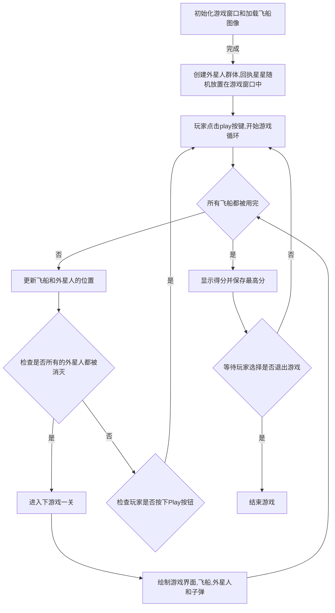

# 《Python程序设计基础》程序设计作品说明书
题目： 外星人入侵游戏👽

学院： 21计科03

姓名： 杨韬

学号： B20210302301

指导教师： 周景

起止日期：2023.11.10-2023.12.10

## 摘要
本项目着眼于开发一款富有趣味性的外星人入侵游戏，基于Python和Pygame技术栈。按照教材第12、13、14章的指导，游戏实现了如下主要功能：

创建游戏窗口，
引入飞船图像，实现飞船的驾驶和射击功能，引入外星人群体，实现外星人的移动和射击机制。添加Play按钮，提供游戏启动入口。引入升级等级机制，计分系统，飞船位置调整，背景丰富化，实现最高分保存。

通过这些功能的实现，项目旨在为用户提供一场充满挑战与乐趣的游戏体验，同时巩固教材中相关章节的知识点。项目的综合评分将根据每项功能的完成度来判定学员对于Pygame游戏开发的掌握程度。在游戏设计中，将游戏的各个元素抽象为类，并通过类的方法来实现相应的功能。此外，在系统架构方面，项目采用了pygame库提供的Sprite类管理游戏中的精灵对象。通过Pytest测试，对游戏中的各个功能模块进行了全面的测试和验证，确保游戏的功能正常运行。

关键词： Python, 技术栈, Pytest,图形用户界面,游戏开发

## 第1章 需求分析
本游戏的目标是创建一个具有丰富功能和良好用户体验的2D游戏。游戏满足了以下需求：

### 1.1 功能需求

1.创建游戏窗口： 游戏在一个窗口中运行，窗口的大小和位置可以由用户调整。

2.添加飞船图像： 游戏有一个代表飞船的图像。

3.驾驶飞船，响应按键： 玩家应能够使用键盘控制飞船的移动和射击，按Q键退出。

4.飞船可以射击子弹： 飞船能够发射子弹，攻击外星人。

5.创建外星舰队： 游戏生成一群外星人，这些外星人会在屏幕上移动，可以被射杀。

6.结束游戏： 当飞船与外星人相撞或者有外星人到达屏幕下边缘时飞船数目减一，当飞船数目用完时，游戏结束。

7.添加Play按钮： 游戏有一个Play按钮，玩家可以通过点击它来开始或重新开始游戏。

8.可以提高等级： 随着游戏的进行，外星人的数量和速度逐渐增加，丰富游戏的挑战性。

9.计分功能： 游戏录入玩家消灭的外星人数，并显示游戏等级和历史最高成绩。

10.左侧射击： 将飞船放在屏幕左侧进行射击，飞船可以上下移动。

11.随机绘制星星： 在游戏背景中随机位置绘制星星。

12.最高分保存： 将游戏中得到的最高分保存到文件中。

### 1.2 非功能需求

1.应用程序应易于使用，界面应友好且直观。

2.游戏应具有良好的性能，包括流畅的动画效果和快速响应时间。

3.代码应具有良好的结构，易于注释、维护和扩展。

4.应用程序应有良好的容错性，能正确处理各种用户输入和异常情况。

5.游戏应有一定的安全性，防止玩家作弊并维护玩家数据隐私权。

## 第2章 分析与设计
### 2.1 系统架构

游戏引擎：

选择Pygame作为游戏引擎，它提供了一系列图形、声音、输入等方面的功能，适用于小型游戏项目。Pygame抽象了许多游戏开发中常见的操作，使得开发者可以专注于游戏逻辑而不必处理太多底层细节。

主模块：

主模块是整个游戏的入口，负责初始化游戏引擎、加载游戏资源，设置游戏窗口，并启动游戏循环。主模块也可以包含全局游戏状态的管理，如当前得分、游戏等级等信息。

模块化设计：

飞船模块：处理飞船的移动、射击逻辑。管理飞船的图像和位置。

外星人模块：管理外星人的生成、移动、射击逻辑。处理外星人与飞船的碰撞检测。

游戏控制模块：处理用户输入，包括键盘事件和鼠标事件。管理游戏的状态，如进行中、暂停、结束等。

计分模块：记录并实时更新玩家的得分。处理等级升级的逻辑。

游戏循环：游戏循环是游戏引擎中一个重要的部分，它不断地重复执行更新游戏状态、处理输入、渲染图像的过程。游戏循环确保游戏保持平滑运行，并实时响应用户输入。

图形绘制和声音：使用Pygame提供的绘图功能，绘制飞船、外星人、子弹等图形。同时，考虑添加音效元素，如射击音效、爆炸音效，以增强游戏的沉浸感。

最高分记录：设计一个简单的数据存储模块，用于保存和读取最高分记录。这可以是一个文件，也可以考虑使用简单的数据库系统。

### 2.2 系统流程

在游戏中，主要的流程如下：

### 2.3 系统模块

2.3.1 alien模块

负责创建和管理外星人。 Alien 类用于表示在游戏中的单个外星人对象，包括其图像、位置、更新和绘制等功能。

首先，定义了一个 Alien 的类。这个类继承自 pygame.sprite.Sprite，表示一个单独的外星人对象。

在 Alien 类的 init 方法中： 调用父类的 init 方法进行初始化。加载外星人的图像，并设置其 rect 属性，然后外星人的初始位置设置在屏幕的左上角（原点位置）并存储外星人的准确位置。

blit_me 方法用于在指定的位置绘制外星人。

update 方法用于更新外星人的位置。它根据外星人设置的方向（舰队方向）和速度因子来更新外星人的 y 值，然后更新 rect 的 y 值。

check_edges 方法用于检查外星人是否到达屏幕的边缘。如果外星人的顶部在屏幕顶部之下，或者外星人的底部在屏幕底部之上，那么就返回 True。

2.3.2 ship模块
负责控制飞船的移动和射击。这个Ship类为pygame游戏提供了一个可以控制和绘制的飞船对象。

初始化飞船：在__init__函数中，首先调用父类Sprite的构造函数，然后加载飞船图像并获取其外接矩形。接着将飞船的初始位置设定在屏幕左部中央。最后，存储飞船的y坐标值，并设置飞船的移动标志为False。
飞船的位置更新：在update函数中，根据移动标志调整飞船的位置。如果飞船正在向上移动并且其顶部没有超过0，那么它会向下移动。如果飞船正在向下移动并且其底部没有超过屏幕的底部，那么它会向上移动。然后根据新的y坐标值更新rect对象。
绘制飞船：在blit_me函数中，将飞船的图像绘制到指定位置。
居中飞船：在center_ship函数中，将飞船的位置调整到屏幕的左侧居中。
此外，还定义了一个函数get_resource_path用于获取资源路径。这个函数首先检查是否存在sys._MEIPASS属性，该属性通常在pygame的打包版本中存在，如果存在则使用sys._MEIPASS作为基路径，否则使用当前目录作为基路径。

2.3.3 bullet模块
负责控制子弹的移动和绘制。这个Bullet类为pygame游戏提供了一个管理飞船发射的子弹的功能，包括子弹的初始化和位置更新，以及在屏幕上绘制子弹。

初始化子弹对象：在__init__函数中，首先调用父类pygame.sprite.Sprite的构造函数，然后创建一个表示子弹的矩形，该矩形的中心与飞船的中心对齐，并且设置在飞船的右侧。然后存储这个矩形的x坐标值，并设置子弹的颜色和速度因子。
更新子弹位置：在update函数中，将子弹的位置向上移动，这是通过增加一个速度因子来实现的。然后更新表示子弹的矩形的位置。

绘制子弹：在draw_bullet函数中，使用子弹的颜色在屏幕上绘制子弹的矩形。

2.3.4 button模块
负责处理玩家点击按钮的事件。这个 Button 类提供了创建、绘制和管理按钮的功能。

在 init 方法中，初始化按钮的属性。首先，获取屏幕对象和其矩形区域。然后设置按钮的宽度和高度、颜色，以及字体。创建一个按钮的矩形对象，并将其中心设置为屏幕矩形的中心。最后，预处理按钮的文本信息，为按钮上的文本做准备。

prep_msg 方法用于将文本渲染为图像，并使其在按钮上居中。首先，使用 font.render 方法将文本渲染为图像，然后获取图像的矩形区域，并将其中心设置为按钮矩形的中心。

draw_button 方法用于绘制按钮。首先，使用 screen.fill 方法填充按钮的颜色，然后使用 screen.blit 方法在按钮上绘制文本图像。

2.3.5 得分模块
当游戏进行时，玩家需要实时获取游戏得分、最高得分、游戏等级和剩余生命等信息。这就需要一个能够在游戏屏幕上显示这些信息的类。Scoreboard类就是一个用于显示游戏得分信息的类。

首先，get_resource_path()方法用于根据相对路径获取资源的绝对路径。这个方法在读取最高得分json文件时使用。

接着，Scoreboard类有一个构造函数__init__()，它用来初始化得分信息的属性。这些属性包括:

self.screen: pygame窗口对象
self.screen_rect: 窗口矩形对象
self.ai_settings: 游戏设置对象
self.stats: 游戏状态对象
self.text_color: 显示文本颜色
self.font: 显示文本的字体

在构造函数中，还调用了prep_images()方法，该方法用于准备包含最高得分、当前得分、游戏等级和飞船的图像。prep_images()方法调用了其他几个方法，分别是：

prep_score(): 将得分转换为一副渲染的图像，并将其放置在屏幕右上角。

prep_high_score(): 将最高得分转换为渲染的图像，并将其放置在屏幕顶部中央。

prep_level(): 将等级转换为渲染的图像，并将其放置在得分下方。

prep_ships(): 显示还余下多少艘飞船。

prep_score()方法将得分转换为一副渲染的图像，使用了pygame.font模块中的方法。得分信息从游戏状态对象(stats)中获取，进行四舍五入后转换成字符串，并添加额外的文本信息“score:”以便于玩家理解。最终产生一个带有得分信息的渲染的图像，该图像被赋值给score_image属性，等待在屏幕上显示。

prep_high_score()方法读取最高得分json文件，将最高得分转换为渲染的图像，并将其放置在屏幕顶部中央。最高得分是通过读取json文件获取的，然后格式化为字符串，并添加额外的文本信息“Highest:”。最终产生一个带有最高得分信息的渲染的图像，该图像被赋值给high_score_image属性，等待在屏幕上显示。

prep_level()方法将游戏等级转换为渲染的图像，并将其放置在得分下方。游戏等级也是从游戏状态对象(stats)中获取，随后进行格式化并添加额外的文本信息“level:”。最终产生一个带有游戏等级信息的渲染的图像，该图像被赋值给level_image属性，等待在屏幕上显示。

prep_ships()方法用于显示还余下多少艘飞船。它使用了一个pygame.sprite.Group()对象来存储飞船实例，并将其放置在屏幕左上角。对于每一艘剩余的飞船，都会创建一个新的飞船实例并添加到ships组中。

最后，show_score()方法用于在屏幕上显示飞船和得分。它通过调用blit()方法将得分和其他信息渲染到游戏屏幕上，同时也将飞船渲染到屏幕左上角。最终实现了在游戏过程中实时更新并显示得分和其他相关信息。

2.3.6 star模块
在游戏屏幕上创建和显示随机大小的星星图像。Star 类用于创建表示星星的图像对象，并在屏幕上显示。

def init(self):：定义 Star 类的初始化方法，当创建一个 Star 对象时，这个方法会被调用。

super(Star, self).init()：调用父类（即 Sprite 类）的初始化方法，以初始化 Star 对象的基本属性。

self.image = pygame.image.load('images\sun233.png')：加载一个图像文件（'images\sun233.png'），并将其存储在 Star 对象的 image 属性中。

random_size = randint(10, 30)：生成一个随机整数，表示星星的随机大小，范围在 10 到 30 之间。

self.image = pygame.transform.smoothscale(self.image,(random_size, random_size))：使用 pygame 的 transform.smoothscale 方法来调整图像的大小，使其宽度和高度都为随机大小。

self.rect = self.image.get_rect()：获取图像的矩形区域（即位置和大小），并将其存储在 Star 对象的 rect 属性中。

### 2.4 关键的实现:数据结构，算法
元组（Tuple）：在测试代码中，使用元组来表示按钮的中心坐标(600, 400)。

列表（List）：用于存储子弹、外星人和星星等游戏元素的实例。例如，bullets = Group()、aliens = Group()和stars = Group()。

队列（Queue）：在游戏中，子弹的发射顺序可能会影响游戏体验。使用队列来管理子弹的顺序，确保按照发射的先后顺序进行更新和绘制。

字典（Dictionary）：用于存储游戏的设置信息。在这段代码中，使用了ai_settings字典来存储屏幕的宽度和高度等设置。

迭代器（Iterator）：在游戏主循环中，使用while True:来不断迭代执行游戏逻辑，直到玩家退出游戏。

碰撞检测算法：在游戏中，需要检测子弹与外星人的碰撞以及飞船与外星人的碰撞。可以采用简单的矩形碰撞检测算法，通过比较对象的矩形边界框来判断是否发生碰撞。

Sprite 类。Sprite 是 Pygame 中的一个类，用于管理游戏中的精灵对象。在 Ship 类中，继承了 Sprite 类，从而实现了飞船的运动和绘制。

随机数生成：在主函数中，使用了随机数生成函数来生成恒星的初始位置和速度，增加游戏的随机性。

### 第3章 软件测试

1.测试Alien类的初始化方法__init__

|\#| 测试目标| 输入 | 预期结果 | 测试结果 |
| --- | --------- | ----- | ---------------- | ----------------- |
| 1 |Alien类的初始化方法__init__|伪造的Settings对象和屏幕|外星人的图像正确加载，矩形区域（位置和大小）正确设置 |通过|

2.测试Alien类的blit_me方法

|\#| 测试目标| 输入 | 预期结果 | 测试结果 |
| --- | --------- | ----- | ---------------- | ----------------- |
| 2 |Alien类的blit_me方法|伪造的Settings对象和屏幕，指定大小和位置|在指定位置绘制外星人的图像，验证图像正确绘制 |通过|

3.测试Ship类的__init__方法

|\#| 测试目标| 输入 | 预期结果 | 测试结果 |
| --- | --------- | ----- | ---------------- | ----------------- |
| 3 |Ship类的__init__方法|初始化Pygame和屏幕|Ship对象的属性正确设置，包括screen、ai_settings和初始状态 |通过|

4.测试Ship类的center_ship方法

|\#| 测试目标| 输入 | 预期结果 | 测试结果 |
| --- | --------- | ----- | ---------------- | ----------------- |
| 4 |Ship类的center_ship方法|创建Ship对象|Ship对象的矩形区域（rect）的中心位置与屏幕的中心位置相同 |通过|

5.测试Scoreboard类的prep_score方法

|\#| 测试目标| 输入 | 预期结果 | 测试结果 |
| --- | --------- | ----- | ---------------- | ----------------- |
| 5 |Scoreboard类的prep_score方法|无 |返回表示得分的图像，验证返回的对象类型 |通过|

6.测试Settings类的initialize_dynamic_settings方法

|\#| 测试目标| 输入 | 预期结果 | 测试结果 |
| --- | --------- | ----- | ---------------- | ----------------- |
| 6 |Settings类的initialize_dynamic_settings方法|创建Settings对象 |ship_speed_factor、bullet_speed_factor、alien_speed_factor、fleet_direction和alien_points被正确初始化 |通过|

### 结论

外星人入侵游戏项目的开发涉及多个方面，从系统设计、模块实现到用户体验等，都需要综合考虑。在完成项目的过程中，可能会面临挑战，但通过良好的规划和设计，可以得到一个有趣、功能完备的游戏。

项目总结：

学习与应用： 通过这个项目，开发者得到了对Python游戏开发和Pygame引擎的实际经验。教材的知识得以巩固和应用，对于理解游戏开发的基本原理有了更深入的认识。

模块化设计： 采用模块化设计，每个功能都由独立的模块负责，提高了代码的可维护性和可扩展性。模块之间的清晰分离使得团队协作更加高效。

用户体验： 通过添加Play按钮、计分系统、升级等级等功能，提升了用户的游戏体验。界面友好、操作简单的设计是游戏成功的重要因素之一。

非功能需求的满足： 在性能、可维护性、用户体验等非功能需求方面，项目都进行了一定的考虑和实现。游戏在运行时表现良好，代码具备一定的可读性和可扩展性。

未来展望：

优化和拓展： 可以进一步优化代码，提高游戏性能，并考虑添加新的功能或关卡以增加游戏的深度。

用户反馈： 收集用户的反馈，了解他们对游戏的看法，以便在未来版本中进行改进。

学习其他技术： 游戏开发是一个广泛的领域，未来可以学习和尝试其他游戏开发工具、引擎或技术，以丰富自己的技术栈。

总体而言，通过这个项目，不仅获得了实际的编码经验，还培养了解决问题和团队协作的能力，为未来的游戏开发或其他项目奠定了基础。

### 参考文献

[1] 《Python编程：从入门到实践》（第2版） ：by Eric Matthes. No Starch Press. 2019年5月

[2] 《Invent Your Own Computer Games with Python》 ：by Al Sweigart. 2010年

[3]《Pytest官方文档》：[https://docs.pytest.org/en/stable/, accessed on 2023-03-28]

[3]《Pytest实战指南》：[https://www.jianshu.com/p/7f0f092f493f, accessed on 2023-03-28]